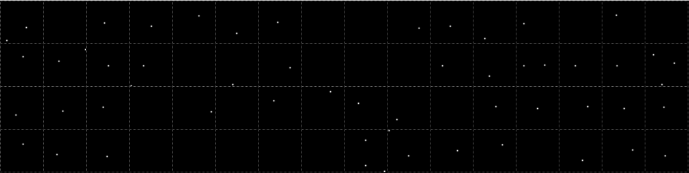
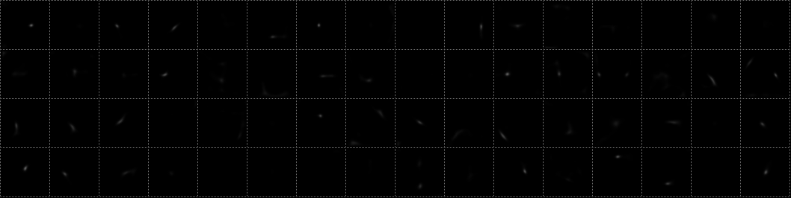

# DeepWindow
A Sliding Window based on Deep Learning for Road Extraction in Remote Sensing

  <b>Abstract: </b>
The template matching methods are commonly applied to extract the road network in remote sensing images. However, the matching rules are manually specified in the traditional template matching methods which may make the extracted road center line deviated from the road center in complex cases and even result in overall tracking errors. The methods based on semantic segmentation exploiting deep learning network greatly increases the extraction performance, nevertheless, the annotation of the training samples is expensive and the post-process is error-prone. We propose DeepWindow, a new method to automatically extract the road network from remote sensing images. DeepWindow uses an iterative sliding window guided by a CNN-based decision function to track the road network directly from the images without the guidance of road segmentation. In our method, the tracking seeds are automatically searched, which get rid of the artificial intervention and makes the process of road tracking process fully automated combing with the road direction estimation. Furthermore, the point annotations for CNN training greatly reduces the cost of model training. Extensive and comprehensive experiments performed on the extraction of roads and retinal vessels indicate that our method is effective and can be applied for tracking topology in other scenes.
  

# Dataset
We use <a href='http://www.cs.toronto.edu/~vmnih/data/'>Massachusetts Roads Dataset</a> to evaluation the performance of our method. 

# Training Samples
To train the road center estimation model, we cut fifty patches with the resolution of 64ⅹ64 from each image in the training set, and finally obtain 55,400 training samples. There are some of our training samples. where the ground truths are gaussians center at the road center points shown in cyan. Note that there are some samples without ground truth for no roads inside these patches.

# Some visual comparisons in training process
We set the train batch-size to 64. We display some visual comparisons between the prediction map and the groud truth, they are expressed in grid images
1. Training images

2. Ground truth

3. prediction visulization

# predicted Samples
Exhibition of more predicted samples, in which the predicted road center points are presented in bold red diamonds. Note that there are some samples without road center points due to none roads in those patches.

# Videos
Our algorithm works in a sliding window mode. It is an evolving process step by step. We release a video to show the tracking process.

<a href='resources/002-3.mp4?raw=true'/>Video 1. A tracking process on a test image (36.5MB).(click here)</a>

# Output Visualization
Exhibition of some road tracking results on the Massachusetts Roads dataset.

<a href='resources/tracking1.png'>tracking1.png</a>

<a href='resources/tracking2.png'>tracking2.png</a>

<a href='resources/tracking3.png'>tracking3.png</a>

<a href='resources/tracking4.png'>tracking4.png</a>

<a href='resources/tracking5.png'>tracking5.png</a>

<a href='resources/tracking6.png'>tracking6.png</a>

<a href='resources/tracking7.png'>tracking7.png</a>

